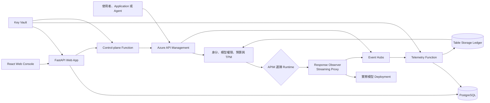
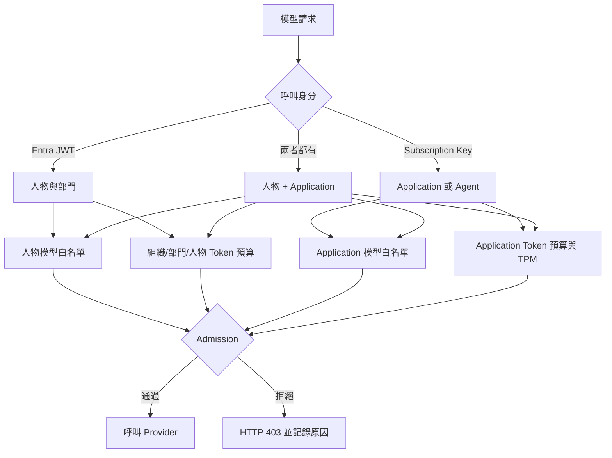

# Turnstile 專案總覽

[toc]

## 專案定位

Turnstile 是一套自行部署的 AI Gateway FinOps 與治理平台。它以 Azure API Management（APIM）作為模型入口，在請求進入 Provider 前執行身分驗證、模型權限與 Token 預算檢查，並將用量與成本資料送入分析平台。

## 目前功能

| 領域 | 已具備功能 |
| --- | --- |
| 身分驗證 | Email/密碼登入、Microsoft Entra 登入、Owner/Member 角色、HTTP-only session |
| 模型管理 | Provider、Connection、Runtime、Model 與 Gateway Registry；模型價格、能力與角色設定 |
| Gateway | OpenAI 與 Anthropic 相容端點、模型權限、Token 預算 admission |
| 模型路由 | APIM Backend Pool 的 failover、balanced、weighted 與自訂 priority/weight |
| 發布管理 | Candidate revision、發布前 probe、版本化 release、diff、integrity check、rollback、保護標籤 |
| 用量分析 | Token、請求數、成本、延遲、錯誤率；依組織、部門、專案、Agent、人物、模型與 Runtime 分析 |
| 預算治理 | 組織 → 部門 → 人物的月度 Token 預算、預警門檻、部門 audit/block、人物模型白名單 |
| Application 治理 | APIM Subscription 建立/同步、Application 或 Agent Token 預算、TPM、模型白名單、key 顯示與輪替 |
| 異常治理 | 錯誤率、延遲、成本與請求量規則；異常清單與處理狀態 |
| FinOps Assistant | 以工具查詢已儲存 telemetry，產生摘要、圖表、對話與釘選報表 |
| GitHub Copilot | OAuth、用量、席位、預算申請與治理整合；目前仍在開發中 |
| Azure 部署 | Bicep 建立 APIM、PostgreSQL、Event Hubs、Functions、Key Vault、App Service 與監控資源，並使用既有 Storage Account |

## 整體架構

### 元件責任

- **APIM**：模型流量入口；執行 admission、路由、即時預留額度與 telemetry 發送。
- **Response Observer**：在 APIM 選定 Runtime 後透明轉送請求，僅解析回應中的 Token usage；不負責選模或預算判斷。
- **FastAPI Web App**：提供管理 API、分析查詢、登入與 React 前端。
- **Telemetry Function**：接收 Event Hub 事件、補齊串流用量、寫入 PostgreSQL 並更新 Ledger。
- **Control-plane Function**：在請求路徑外套用 APIM 發布、同步 Subscription 與 release 操作。
- **PostgreSQL**：保存設定、帳號、治理政策、用量、成本、audit 與 release 狀態。
- **Table Storage Ledger**：提供 APIM 低延遲的預算狀態，避免推論時回呼 Web App。
- **Key Vault**：保存平台部署秘密；Provider credential 主要以 Fernet 密文存入 PostgreSQL。

## 成本控管流程

| 呼叫方式 | 用途 | 套用控制 |
| --- | --- | --- |
| Entra JWT | 員工直接使用 Gateway | 人物模型權限、組織/部門/人物預算 |
| Subscription Key | 無人操作的服務或 Agent | Application 模型權限、月度 Token 預算、TPM |
| JWT + Subscription Key | Application 代表已登入員工呼叫 | 人物與 Application 兩層控制 |

Subscription key 的分配單位是 Application 或 Agent，不是每位員工或每個部門。每個
APIM Subscription 有 primary 與 secondary key，以支援無停機輪替。

### Admission 實際演算法

APIM 在請求到達 Provider 前依序執行以下檢查。任何明確拒絕都會先寫入 Event Hubs，
再回傳 HTTP 403

1. **解析請求模型**：確認模型存在於目前發布的 Gateway Revision。
2. **驗證人物身分**：若有 Bearer token，驗證 tenant、client、audience 與
    `Model.Invoke` scope，再從 token 取得人物、部門與 client application。
3. **人物 TPM**：以 Entra tenant + object ID 作為 counter key，執行每分鐘 Token
    上限。
4. **人物模型權限**：從 Ledger 讀取人物模型白名單。未設定策略時，舊模型維持相容
    開放；標記為 `assignment_required` 的新發布模型則要求明確指派。
5. **人物月度預算**：讀取 `Person + YYYY-MM` Ledger partition，以
    `remaining = limit - confirmed - reservations` 計算剩餘額度。部門為 `audit` 或人物
    未設定預算時不阻擋；部門為 `block` 狀態且請求無法放入剩餘額度時拒絕。
6. **解析 Application**：若有 Subscription Key，以 Gateway + APIM Subscription ID
    查找 Application；不存在、停用或 scope 已失效時拒絕。
7. **Application 模型與預算**：檢查 Application 模型白名單、TPM 與月度 Token
    預算。
8. **即時預留**：通過後，分別在適用的 Ledger partition 寫入 reservation。輸出上限
    超過剩餘額度時，非 compact 請求會盡可能下調 `max_tokens`，而不是直接拒絕。
9. **轉送與結算**：移除內部驗證 header，將請求送往選定 Runtime；Response Observer
    取得最終 Token 用量後，由 Telemetry Function 以實際用量結算並移除 reservation。

Ledger 讀寫失敗採 **fail open**：請求繼續，但 admission 狀態會標記為
`ledger_unavailable` 或 `ledger_write_failed`，讓管理者知道預算保護當時沒有完整生效。

### JWT + Subscription Key 是否重複扣款

同時提供 JWT 與 Subscription Key 時，同一筆 usage 會同時歸屬兩個 scope：

| 項目 | 計入 scope |
| --- | --- |
| 人物用量與預算 | JWT 對應的 Person，以及其 Department、Organization |
| Application 用量與預算 | Subscription Key 對應的 Application |
| Provider 實際成本 | 僅一筆，不會重複計費 |

兩個 scope 都會扣除各自的治理額度，但共用同一筆 `token_usage` 成本紀錄；因此人物與
Application 報表是兩種歸屬視角，不應相加。

## 主要缺口

- 沒有 Organization、Department、Project、Person 與帳號管理 CRUD (硬編碼)。
- Application 的 `owner_id`、`department_id` 現在建立都寫 `NULL`，目前沒辦法得知負責人、subscription key 成本在哪個部門組織。
- 沒有 USD 預算與 USD admission；目前只提供 Token 預算及 USD 成本分析。
- 串流回應的 cache usage 可能無法完整取得，因此部分成本是下限。
- 沒有依 prompt、成本或模型能力自動選模的 Model Intelligent Router。
- GitHub Copilot 整合仍在開發中，不應直接作為正式財務決策依據。
- FinOps Assistant 的數字與圖表由查詢工具產生，但最終文字摘要尚未逐項驗證所有數字均來自工具結果。